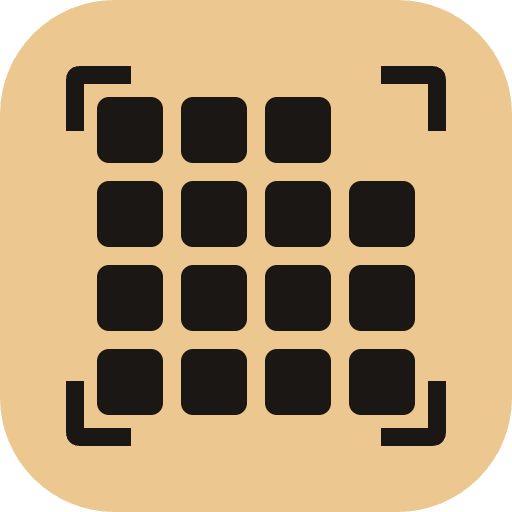

<p align="center">
  
</p>

<h1 align="center">JuiceScreen</h1>

<p align="center">
  <em>Open-source screen capture for macOS — local, readable, no telemetry.</em>
</p>

---

If your daily flow is region capture → annotate → keep, and you'd like the captures indexed and searchable on your own machine, JuiceScreen covers that. If your daily flow is region capture → cloud upload → share-link, keep CleanShot — JuiceScreen has no upload story and no plan for one. The point is local files you can grep with OCR, not a hosted service.

Region, window, full-screen, and scrolling-area capture. Video recording with audio. Annotation. A local SQLite library indexed by on-device OCR. Open source, MIT, no telemetry.

The DMG is unsigned — there is no Apple Developer ID behind the project, so first launch needs a right-click → Open.

**Status:** v1.0.5 is the latest published DMG; v1.0.6 is committed locally and in draft on GitHub but not yet released. v1.0.0 shipped install-broken on macOS 14.4+ (Sparkle framework signature mismatch); 1.0.1 fixed the bundling and 1.0.2 onward are user-facing fixes from real first-week use. Per-version detail in `docs/CHANGELOG.md`. Screen recording in 1.0.5 has known issues (empty MP4 on some Retina displays, control-bar Stop button intermittent) that are being fixed in the next release.

## Contents

- [What it does](#what-it-does)
- [Installing](#installing)
- [Tutorial](#tutorial)
  - [Capture a region and annotate it](#capture-a-region-and-annotate-it)
  - [Record a video of the screen](#record-a-video-of-the-screen)
  - [Trim a recording](#trim-a-recording)
  - [Capture a scrolling area](#capture-a-scrolling-area)
  - [The library and OCR search](#the-library-and-ocr-search)
  - [Settings](#settings)
- [Hotkey reference](#hotkey-reference)
- [Security](#security)
- [Privacy](#privacy)
- [Known limitations](#known-limitations)
- [Developing](#developing)
- [License](#license)
- [Roadmap](#roadmap)

## What it does

- Capture region (`⌘⇧4`), full-screen (`⌘⇧3`), window, last region (`⌘⇧R`), or a scrolling area (`⌘⇧6`).
- Record full-screen video (`⌘⇧5`) at 30 or 60 fps. System audio plus microphone on separate tracks. Optional cursor highlight ring, click pulse, and keystroke overlay (the latter two require Input Monitoring — see [Privacy](#privacy) for what is read and where it goes).
- Trim recordings post-record. Two-handle scrubber; exports a new MP4 at the chosen range.
- Annotate with 11 tools and undo/redo. Save as PNG, JPG, or rasterized PDF.
- Every capture and recording is indexed in a local SQLite database. Free-text search runs over on-device OCR with filters: `aws error from:Safari after:2026-04-15 type:image`. Soft-delete with 30-day garbage collection; restore from the inspector.

## Installing

1. Download `JuiceScreen-X.Y.Z.dmg` from [Releases](https://github.com/mkupermann/JuiceScreen/releases).
2. Open the DMG and drag `JuiceScreen.app` to `/Applications`.
3. Right-click `JuiceScreen.app` → **Open** → confirm. On macOS 14.4 and later, macOS redirects you to **System Settings → Privacy & Security → Open Anyway** — that confirmation is required for every unsigned app.
4. Grant Screen Recording permission when the first capture is triggered.
5. The first-run wizard covers the rest.

Notarization needs a paid Apple Developer account; the project does not have one. Updates after the first install are verified via Sparkle's EdDSA signing.

## Tutorial

The shortest path through every capability. None of the flows below need anything beyond a fresh install and Screen Recording permission.

### Capture a region and annotate it

The most common workflow.

1. Press `⌘⇧4`. The cursor turns into a crosshair and the screen dims.
2. Click and drag to draw a rectangle around what you want to capture. Release to confirm. The dim layer disappears and the **annotation editor** opens with the captured pixels at full resolution.
3. The toolbar at the top of the editor shows two rows. The top row groups tools by function — Select on the left, then shapes (arrow, double arrow, line, rectangle, ellipse), then drawing (pen, highlighter), then annotation (text, blur), and crop on the right. The bottom row shows controls that change with the active tool.
4. Pick the **Arrow** tool (`A`). Pick a colour from the swatch in the contextual row. Drag from where you want the arrow to start to where it should point.
5. Pick the **Text** tool (`T`). Type the text you want into the field at the left of the contextual row. Press **Return** to drop it at the centre of the canvas, or click anywhere on the canvas to drop it at that point. The tool then switches back to Select so you can immediately reposition or restyle the text.
6. Pick the **Blur** tool (`B`). The contextual row shows a Blur / Pixelate switch and an intensity slider. Drag a rectangle over anything that should be redacted. The blur effect previews live as you drag — what you see on canvas is what the exported file shows.
7. Press `⌘C` to copy the annotated image to the clipboard, `⌘S` to save in place, or `⌘⇧S` to save somewhere else (PNG, JPG, or PDF).

To **edit an existing annotation**, switch to the Select tool (`V`), click the layer you want to change, and use the controls in the contextual row. Color, thickness, fill, text content, font and blur intensity all update in place. Drag the selected layer to move it. `⌘Z` and `⌘⇧Z` undo and redo. `Delete` removes the selected layer.

### Record a video of the screen

1. Press `⌘⇧5`. A small floating control bar appears at the bottom of the screen showing the elapsed time, a Stop button, and a Mic toggle. **Esc** also stops the recording.
2. macOS prompts for Screen Recording permission the first time. Grant it.
3. The recording captures the primary display at the rate set in **Settings → Recording** (default 60 fps). System audio is mixed in by default; the microphone is off by default.
4. Click the stop button on the floating bar, or press `⌘⇧5` again, to end the recording. The MP4 file lands in `~/Pictures/JuiceScreen/<date>/` and a `.video` row appears in the library.

If you want microphone audio, click pulse, or keystroke overlay, enable each in **Settings → Recording** before starting. Click pulse and keystroke overlay both require macOS Input Monitoring permission; JuiceScreen prompts for it the first time you turn either on.

### Trim a recording

1. Open the library with `⌘⇧L`.
2. Double-click any video tile. The Trim Editor opens with an AVPlayer preview and a scrubber with two draggable handles.
3. Drag the left handle to the start of the keep-range, the right handle to the end. The preview snaps to whichever handle you are dragging.
4. **Save Trim** writes a new MP4 next to the original with the chosen range. **Save Trim As** opens a save panel.

The original recording is unchanged.

### Capture a scrolling area

This is the most experimental feature in v1.0. It works on most native macOS apps and simple web pages. It produces ghosting or torn frames on pages with sticky headers, lazy-loaded content, or parallax — about 30% of complex web pages in testing.

1. Press `⌘⇧6`. A prompt window appears with a Start button.
2. Click **Start**. The cursor turns into a crosshair.
3. Drag a rectangle around the region that contains the scrollable content (typically a single column of a web page or document).
4. A floating control bar appears with a frame counter and a stop button.
5. Scroll the content with two-finger swipe or the scroll wheel — slowly. Each visible frame is captured at 10 fps and stitched into a growing tall image.
6. Press **Esc** or click the stop button. The stitched image opens in the annotation editor as a single tall PNG.

If the result has visible seams or ghosting, the page used a stitching-hostile pattern (sticky element, lazy load, parallax). The stitcher does not lie about this — what you see is what gets saved. Use the [Known limitations](#known-limitations) section for the details.

### The library and OCR search

Every capture and recording is indexed in a local SQLite database the moment it is saved. Image captures additionally run through Apple's Vision framework on a background queue, and the extracted text is added to an FTS5 index inside the same database. All on-device.

1. Press `⌘⇧L`. The library window opens with a sidebar on the left, a tile grid in the middle, and an inspector on the right.
2. The sidebar offers smart filters: All, Images, Videos, Trash. Click any of them to filter the grid.
3. The search bar at the top accepts free text and a small filter language:
    - `aws error` matches captures whose OCR contains both words.
    - `from:Safari` restricts to captures whose source app is Safari.
    - `after:2026-04-15` and `before:2026-05-01` bound the captured-at date.
    - `type:image` and `type:video` restrict by media type.
    - All filters compose: `aws error from:Safari after:2026-04-15 type:image`.
4. Click any tile to see metadata, the OCR text, and per-capture actions in the inspector.

To delete a capture, select it and click **Move to Trash** in the inspector. To restore one, switch to the Trash filter, select the capture, and click **Restore**. Trash is garbage-collected at 30 days.

To free disk space immediately, **Settings → Storage → Empty trash now** purges every trashed item and removes the underlying files. The current capture count, total bytes, and trashed-bytes are shown there as well.

### Settings

Six tabs, all backed by the same `~/Library/Preferences/com.bks-lab.juicescreen.plist`. Changes persist immediately.

- **General**: start at login, default save folder, default still format (PNG or JPG), JPG quality slider.
- **Capture**: image scale (Retina or 1×), include cursor in still captures (off by default).
- **Recording**: target frame rate (30 or 60 fps), system audio, microphone, cursor highlight ring, click pulse, keystroke overlay.
- **Hotkeys**: read-only display of all bindings (rebinding UI lands in v1.1).
- **Storage**: capture count, disk usage, trash size, Open save folder, Empty trash now, OCR languages.
- **About**: version, GitHub link, MIT license link, Sparkle Check for Updates and auto-check toggle.

## Hotkey reference

| Action | Shortcut |
| --- | --- |
| Capture region | `⌘⇧4` |
| Capture full screen | `⌘⇧3` |
| Capture window | (menu bar → Capture → Window) |
| Capture last region | `⌘⇧R` |
| Capture scrolling area | `⌘⇧6` |
| Record screen | `⌘⇧5` |
| Open library | `⌘⇧L` |
| Open Settings | (menu bar → Settings) |

Inside the annotation editor:

| Action | Shortcut |
| --- | --- |
| Select tool | `V` |
| Arrow / Double arrow | `A` / `⇧A` |
| Line | `L` |
| Rectangle | `R` |
| Ellipse | `E` |
| Pen / Highlighter | `P` / `H` |
| Text | `T` |
| Blur / Pixelate | `B` |
| Crop | `C` |
| Undo / Redo | `⌘Z` / `⌘⇧Z` |
| Duplicate selection | `⌘D` |
| Delete selection | `Delete` |
| Copy to clipboard | `⌘C` |
| Save / Save As | `⌘S` / `⌘⇧S` |

## Security

Report security issues through GitHub's private vulnerability reporting on the repository (`Security` tab → `Report a vulnerability`). 90-day disclosure window unless an extension is requested.

The DMG is unsigned and not notarized — see [Known limitations](#known-limitations). Updates are EdDSA-signed via [Sparkle](https://sparkle-project.org/); the public key is embedded in the app's `Info.plist`:

```
SUPublicEDKey: HZpQrkusoZ1yjxUM6xALA5TB72R9/ma5x/PgY3VDdIo=
SUFeedURL:     https://mkupermann.github.io/JuiceScreen/appcast.xml
```

To verify the running app's embedded key matches this README, run inside `/Applications/JuiceScreen.app`:

```bash
plutil -extract SUPublicEDKey raw -o - Contents/Info.plist
```

If that string ever changes without a corresponding README change in the same release, do not accept the update.

## Privacy

Two network calls and only two:

1. Sparkle fetches the appcast XML from `https://mkupermann.github.io/JuiceScreen/appcast.xml` on launch and every 24 hours. Disable in Settings → About.
2. Sparkle downloads a new DMG from `github.com` when you accept an update.

No telemetry, no analytics, no crash reporter, no third-party SDKs. Verifiable with [Little Snitch](https://obdev.at/products/littlesnitch/) or [Lulu](https://objective-see.org/products/lulu.html) — filter on process name `JuiceScreen`; Sparkle traffic comes from the same process, not a helper.

What the three TCC permissions do:

- **Screen Recording**: frame data goes to local PNG / MP4 / PDF files in your save folder and to a local SQLite library at `~/Library/Application Support/JuiceScreen/`. JuiceScreen never transmits this.
- **Microphone**: only requested when microphone capture is enabled in Settings → Recording. PCM audio is multiplexed into the recording's MP4 container. Microphone capture only runs while a recording is active.
- **Input Monitoring**: only requested when click pulse or keystroke overlay is enabled in Settings → Recording. Pointer-click locations and the last three keys pressed are read so the recorder can draw the overlay into the video frames. Held in process memory only, discarded when the recording session ends — nothing leaves the process. The implementation lives in `JuiceScreen/Capture/Video/Recording/` and `JuiceScreen/Capture/Video/Cursor/`; the `KeystrokeTracker` source is auditable.

For source-level verification: `grep -rEn 'URLSession|URLRequest' JuiceScreen/` returns zero matches in the app code. The only network entry point is Sparkle, configured in `Info.plist`.

What this does **not** protect against:

- Anything else that runs as your user on the same Mac can read the capture files in your save folder and the SQLite library — JuiceScreen's protection ends at the process boundary, not at filesystem ACLs.
- Time Machine, iCloud Desktop / Documents sync, Backblaze, Carbon Copy Cloner, etc. will pick up the save folder and the library if you have those configured to include `~/Pictures/` or `~/Library/Application Support/`. JuiceScreen does not transmit; your backup tool might.
- A malicious DMG hosted at the same GitHub Releases URL would still be rejected by Sparkle's EdDSA check on the appcast — but only if you took an update. The initial install is unsigned, so verify the SHA-256 in the release notes against the file you downloaded before the right-click → Open step.

## Known limitations

- The DMG is unsigned. First launch needs the right-click → Open step in the [Installing](#installing) section. On macOS 14.4 and later, this redirects you to **System Settings → Privacy & Security → Open Anyway** — that step is required, not optional.
- macOS 14 minimum.
- No iCloud sync. By design — the library stays on the local machine.
- macOS 15 may re-prompt for Screen Recording permission roughly weekly. Apple's behaviour, not configurable from inside the app.
- Scroll capture works on most native macOS apps and simple web pages. It produces ghosting or torn frames on pages with sticky headers, lazy-loaded content, or parallax — about 30% of complex web pages in testing.
- Scroll capture handles vertical scroll only in v1.0.
- PDF export is rasterized. Vector PDF is on the v1.1 list.
- The auto-update feed is served from GitHub Pages and can lag a new release by ~60 seconds.
- Hotkey rebinding UI lands in v1.1; the Hotkeys settings tab is read-only in v1.0.

What JuiceScreen deliberately does not do, and where the gaps are vs. CleanShot X / similar:

- **No cloud upload, no shareable links.** The flow is `capture → file on disk → library`. There is no JuiceScreen-hosted destination, and adding one would change the project's local-first model.
- **No GIF export in v1.0.** Recordings are MP4 only. GIF export is on the v1.1 list.
- **No pinned / floating screenshots.** The annotation editor opens in a regular window; there is no "stick this to the screen above other windows" mode.
- **No ProRes / HDR recording.** Recordings are H.264 8-bit at the rate selected in Settings.
- **Not designed for managed-fleet deployment.** No notarized PKG, no Jamf / Munki recipe, no MDM-friendly default-off auto-update. JuiceScreen targets individual installs; fleet deploy is not a v1.x goal.

## Developing

Requirements: macOS 14 or newer, Xcode 16 or newer, [XcodeGen](https://github.com/yonaskolb/XcodeGen) (`brew install xcodegen`).

```bash
git clone https://github.com/mkupermann/JuiceScreen.git
cd JuiceScreen
xcodegen generate
open JuiceScreen.xcodeproj
```

The `.xcodeproj` is regenerated from `project.yml` and is not committed. Edit `project.yml`, not the generated project.

Tests (260 unit tests in 63 suites + a UI smoke test; runs in ~2 seconds on M-series):

```bash
xcodebuild test -scheme JuiceScreen -destination 'platform=macOS'
```

Build and run from CLI:

```bash
xcodebuild -scheme JuiceScreen -destination 'platform=macOS' build
open "$(xcodebuild -scheme JuiceScreen -showBuildSettings | awk -F' = ' '/ TARGET_BUILD_DIR /{print $2}' | head -1)/JuiceScreen.app"
```

The codebase is a single Swift application target with disciplined folder boundaries:

```
JuiceScreen/
├── App/             ← AppDelegate, JuiceScreenApp, ActivationPolicyController
├── Annotation/      ← editor, layers, renderer, export pipeline
├── Capture/         ← image + video capture via ScreenCaptureKit
├── Library/         ← SQLite, FTS5, thumbnails, trash, OCR storage
├── MainWindow/      ← Library + Settings windows
├── MenuBar/         ← NSStatusItem, hotkey service
├── OCR/             ← Vision pipeline + sidecar JSON store
├── Permissions/     ← TCC + first-run flow
├── Preferences/     ← Preferences value type + UserDefaults store
├── Scroll/          ← scroll capture + frame stitcher
├── Trim/            ← post-record video trim editor
├── Updates/         ← Sparkle wrapper
└── Shared/          ← Hotkey, AppLog, FilenameGenerator, etc.
```

For release packaging see `docs/RELEASE.md`. For per-release manual checks see `docs/QA-CHECKLIST.md`. The implementation specification lives at `docs/superpowers/specs/2026-05-04-juicescreen-design.md`.

CI runs `xcodebuild test` on macOS via GitHub Actions (`.github/workflows/ci.yml`). PRs need to stay green there. Issues and PRs at <https://github.com/mkupermann/JuiceScreen/issues> — PRs are welcome on bug fixes, new annotation tools, and additional capture / export formats. Larger changes (new windows, schema migrations, anything that touches the capture pipeline) are easier to land if you open an issue first.

## License

MIT — see `LICENSE`.

Bundled third-party dependencies, all permissive:

- [Sparkle](https://github.com/sparkle-project/Sparkle) — MIT, used for in-app updates.
- [GRDB](https://github.com/groue/GRDB.swift) — MIT, used for the SQLite + FTS5 library store.
- SQLite (system) — public domain, linked by the macOS SDK.

## Roadmap

v1.1 is a wishlist, not a schedule — there is no paid maintainer behind this and no committed dates. Items below ship if and when there is time and (where noted) funding to ship them.

- Vector PDF export (the v1.0 PDF is rasterized).
- Horizontal scroll capture; sticky-header masking for the cases v1.0 ghosts on.
- Optional iCloud library backup, off by default. The local-first model stays.
- Notarization. Blocked on funding an Apple Developer account ($99/year). Once that's in place, the next minor release will ship a Developer-ID-signed and notarized DMG so first launch no longer needs the right-click → Open dance. Sponsoring this is the single biggest unlock for the project; reach out via the issue tracker if interested.
- Hotkey rebinding UI in Settings.
- Counter / numbered marker annotation tool.

Per-version detail in `docs/CHANGELOG.md`.
